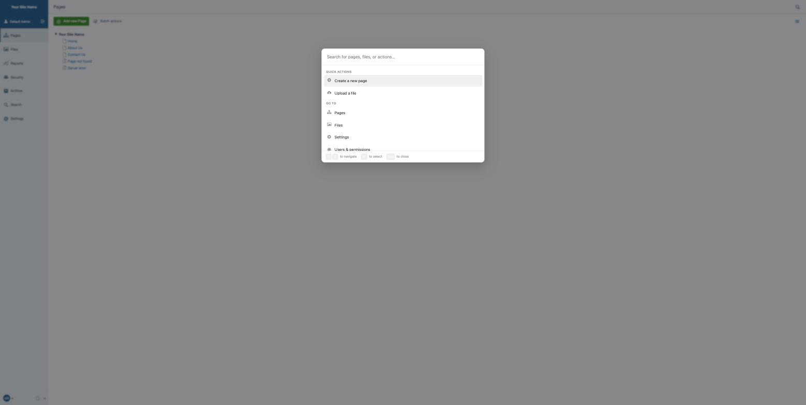

# silverstripe-admin-cmdk

Adds a [cmdk](https://github.com/pacocoursey/cmdk)-style command palette (&#8984;K) to the
SilverStripe CMS admin — jump to pages, files, and CMS actions, or search your content, without
leaving the keyboard.



## Features

- **&#8984;K / Ctrl+K** anywhere in the CMS, or click the **Search** icon added to the CMS menu.
- **PHP-first configuration** — register commands and groups from your project's `_config.php`,
  the same way you'd configure `CMSMenu`.
- **Permission-aware** — every command and search result is checked against the current member's
  permissions on the server before it's sent to the browser. A user never sees a command or a page
  they can't access, even briefly.
- **Pluggable search** — ships with a basic ORM-based `DatabaseSearchProvider`, replaceable on a
  per-project basis with Algolia, Elasticsearch, or anything else via `Injector`.

| CMS menu trigger | Live search |
| --- | --- |
|  |  |

## Requirements

- PHP ^8.2
- silverstripe/framework ^6
- silverstripe/cms ^6
- silverstripe/admin ^3

## Installation

```
composer require wilr/silverstripe-admin-cmdk
```

No further setup is required — the module ships with a handful of default commands (jump to
Pages, Files, Settings, Security) and works immediately for any CMS user, filtered to what they
have permission to access.

## Quick start: adding your own commands

Register commands from your project's `app/_config.php`:

```php
use Wilr\AdminCmdk\CommandPalette;
use Wilr\AdminCmdk\Model\Command;

CommandPalette::group('content', 'Content')
    ->addCommand(
        Command::create('new-product')
            ->setLabel('Create a new product')
            ->setIcon('font-icon-plus-circled')
            ->setKeywords(['add', 'catalogue'])
            ->setLink('admin/products/add')
            ->setPermission('CMS_ACCESS_ProductAdmin')
    );
```

See [`docs/en/configuration.md`](docs/en/configuration.md) for the full API reference, and
[`docs/en/search-providers.md`](docs/en/search-providers.md) for writing a custom search backend.

## Disabling the module

```yaml
Wilr\AdminCmdk\Extensions\LeftAndMainCmdkExtension:
  enabled: false
```

## Development

```
composer install
yarn install

vendor/bin/phpunit
yarn test
yarn build
```

The module ships its built `client/dist` assets committed to the repository, so consumers
installing via Composer don't need a Node toolchain — only contributors building from source do.

## License

BSD-3-Clause
